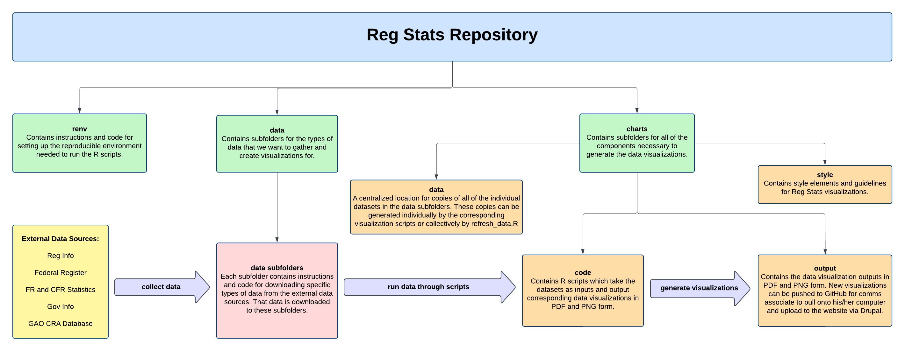

# Reg-Stats

This repository hosts the code to collect data and generate charts for [Reg Stats](https://regulatorystudies.columbian.gwu.edu/reg-stats).

## Repository Structure

The project root contains several files, including an RStudio project (.Rproj), an .Rprofile configuration file, and a renv.lock file (the lockfile establishes the R environment packages used).

In addition to these files, there are several directories:

- charts/
  - contains the R code for updating Reg Stats charts, chart style information, and data visualization output
  - see this sub-directory's README for more details
- data/
  - contains sub-directories for each Reg Stats chart and dataset
  - each sub-directory contains instructions for updating each Reg Stats dataset (either automatically or manually), the Python code for collecting the data (when automated), and the data for each dataset
  - see the README within each sub-directory for more details
- renv/
  - contains the profiles associated with the project lockfiles; this is where package binaries will be installed on your local machine

The structure of the repository is depicted below:

\ 

## R Environment Set Up

1. Download requirements  

    Steps:
     - [R](https://cran.rstudio.com/) version 4.2.2 or 4.3.1 (you need one of these versions of R to activate the environment properly).  
     - The [RStudio](https://posit.co/download/rstudio-desktop/) integrated development environment (IDE).  
     - [renv](https://rstudio.github.io/renv/index.html) (currently using `renv@1.0.3`).  
     - You may also need tools for compiling R on your machine to build R packages from source. See details for [Windows](https://cran.rstudio.com/bin/windows/Rtools/rtools40.html) and [macOS](https://cran.r-project.org/bin/macosx/tools/).  

2. Clone repository  
  
    Clone the repository from GitHub if it isn't present on your local machine. See the [GitHub Docs](https://docs.github.com/en/repositories/creating-and-managing-repositories/cloning-a-repository) for instructions.  

3. Open project in RStudio  

    There are several ways to do this. One is clicking on the Reg-Stats.Rproj file in the repo. Another is opening a new Rstudio session, go to the project button at the top right corner, and select open project (or open in new session). When you open the project, RStudio should recognize the project was loaded with a specific version of renv.  

4. Activate the environment using renv  

    Steps:
      - You will need to activate the renv profile associated with the version of R you're running. If using R 4.3.1, run the command `renv::activate(profile = "R_431")` to open the profile with the lockfile corresponding to R 4.3.1 packages. If using R 4.2.2, run `renv::activate(profile = "R_422")`. See the [renv docs](https://rstudio.github.io/renv/articles/profiles.html) for more information.  
      - Run `renv::restore()` to align your environment with the lockfile.  
      - If you continue to have issues restoring the environment, you may be able to skip this step and install required packages using `utils::install.packages()`.  
