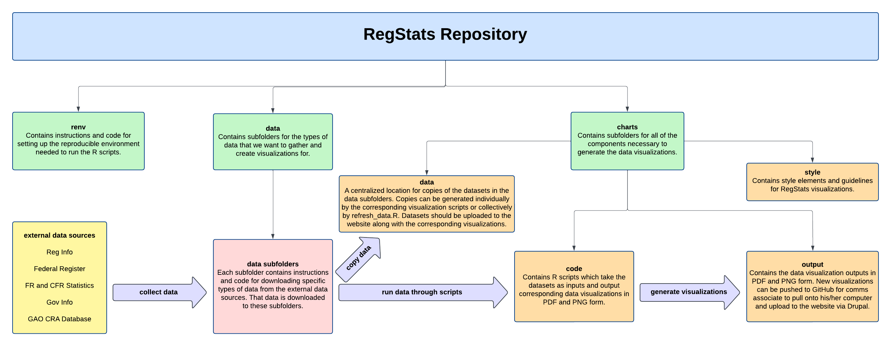

# Reg-Stats

This repository hosts the code to collect data and generate charts for [Reg Stats](https://regulatorystudies.columbian.gwu.edu/reg-stats).

## Repository Structure

The project root contains several files, including an RStudio project (.Rproj), an .Rprofile configuration file, and a renv.lock file (the lockfile establishes the R environment packages used).

In addition to these files, there are several directories:

- charts/
  - contains the R code for updating Reg Stats charts, chart style information, and data visualization output
  - see this sub-directory's README for more details
- data/
  - contains sub-directories for each Reg Stats chart and dataset
  - each sub-directory contains instructions for updating each Reg Stats dataset (either automatically or manually), the Python code for collecting the data (when automated), and the data for each dataset
  - see the README within each sub-directory for more details
- renv/
  - contains the profiles associated with the project lockfiles; this is where package binaries will be installed on your local machine

The structure of the repository is depicted below:

 

## Instructions for Updating Data and Charts

For updating the data or charts, follow the instructions in each subdirectory. The following list provides a summary of
files and output corresponding to each data series in Reg Stats.

After setting up the required Python or R environment (see instructions in each subdirectory), run the Python or R code
in the "File" column, and an output dataset or chart in the "Output" column will be generated.

#### Example 1: Economically Significant Final Rules Published by Presidential Year
<table>
  <tr>
    <th>Update</th>
    <th>Task</th>
    <th>Location</th>
    <th>File</th>
    <th>Output</th>
  </tr>
  <tr>
    <td rowspan="2">Annual: 1st week of Feb</td>
    <td>Data</td>
    <td><code>data/es_rules/</code></td>
    <td><code>update_es_rules.py</code></td>
    <td><code>econ_significant_rules_by_presidential_year.csv</code></td>
  </tr>
  <tr>
    <td>Chart</td>
    <td><code>charts/</code></td>
    <td><code>code/econ_significant_rules.Rmd</code></td>
    <td>
      <code>output/econ_significant_rules_published_by_presidential_year.pdf</code> 
      <code>output/econ_significant_rules_published_by_presidential_year.png</code>
    </td>
  </tr>
</table>

  
<strong>Example 2: Economically Significant Final Rules Published by Presidential Year</strong>

   

  <table>
    <tr>
      <th>Update</th>
      <th>Task</th>
      <th>Location</th>
      <th>File</th>
      <th>Output</th>
    </tr>
    <tr>
      <td rowspan="2">Annual: 1st week of Feb</td>
      <td>Data</td>
      <td><code>data/es_rules/</code></td>
      <td><code>update_es_rules.py</code></td>
      <td><code>econ_significant_rules_by_presidential_year.csv</code></td>
    </tr>
    <tr>
      <td>Chart</td>
      <td><code>charts/</code></td>
      <td><code>code/econ_significant_rules.Rmd</code></td>
      <td>
        <code>output/econ_significant_rules_published_by_presidential_year.pdf</code> 
        <code>output/econ_significant_rules_published_by_presidential_year.png</code>
      </td>
    </tr>
  </table>

#### Economically Significant Final Rules by Agency
| Task  | Location         | File | Output                                                                                                                                                      |
|-------|------------------| ---- |-------------------------------------------------------------------------------------------------------------------------------------------------------------|
| Data  | `data/es_rules/` | `by_agency/update_agency_es_rules.py` | `agency_econ_significant_rules_by_presidential_year.csv`                                                                                                    |
| Chart | `charts/`        | `code/agency_econ_significant_rules_by_presidential_year.Rmd` | `output/by_agency/[agency]_econ_significant_rules_by_presidential_year.pdf` `output/by_agency/[agency]_econ_significant_rules_by_presidential_year.png` |

#### Monthly Significant Final Rules under the Biden Administration
| Task  | Location                 | File | Output                                                                                                                                              |
|-------|--------------------------| ---- |-----------------------------------------------------------------------------------------------------------------------------------------------------|
| Data  | `data/monthly_es_rules/` | `update_monthly_sig_rules_by_admin.py` | `monthly_significant_rules_by_admin.csv`                                                                                          |
| Chart | `charts/`                | `code/monthly_sig_rules_by_admin.Rmd` | `output/monthly_significant_rules_biden.pdf` `output/monthly_significant_rules_biden.png` |

#### Cumulative Economically Significant Final Rules by Administration
| Task  | Location                 | File | Output                                                                                                                                              |
|-------|--------------------------| ---- |-----------------------------------------------------------------------------------------------------------------------------------------------------|
| Data  | `data/cumulative_es_rules/` | `update_cumulative_es_rules.py` | `cumulative_econ_significant_rules_by_presidential_month.csv`                                                                                          |
| Chart | `charts/`                | `code/cumulative_econ_significant_rules_by_admin.Rmd` | `output/cumulative_econ_significant_rules_by_presidential_month.pdf` `output/cumulative_econ_significant_rules_by_presidential_month.png` |

#### Cumulative Economically Significant Final Rules Published by Administration in First Year
| Task  | Location                 | File | Output                                                                                                                                              |
|-------|--------------------------| ---- |-----------------------------------------------------------------------------------------------------------------------------------------------------|
| Data  | `data/cumulative_es_rules/` | `update_cumulative_es_rules.py` | `cumulative_econ_significant_rules_by_presidential_month.csv`                                                                                          |
| Chart | `charts/`                | `code/cumulative_econ_significant_rules_first_year.Rmd` | `output/cumulative_econ_significant_rules_by_first_year.pdf` `output/cumulative_econ_significant_rules_by_first_year.png` |

#### Significant Final Rules Published by Presidential Year
| Task  | Location                | File | Output                                                                                                                                              |
|-------|-------------------------| ---- |-----------------------------------------------------------------------------------------------------------------------------------------------------|
| Data  | `data/sig_rules/` | `update_sig_rules.py` | `significant_rules_by_presidential_year.csv`                                                                                          |
| Chart | `charts/`         | `code/significant_rules.Rmd` | `output/significant_rules_by_presidential_year.pdf` `output/significant_rules_by_presidential_year.png` |

#### Major Final Rules Published by Presidential Year
| Task  | Location                | File | Output                                                                                                                                              |
|-------|-------------------------| ---- |-----------------------------------------------------------------------------------------------------------------------------------------------------|
| Data  | `data/major_rules/` | `cradb/scraper.py` `cradb/process_data.py` | `major_rules_by_presidential_year.csv`                                                                                          |
| Chart | `charts/`         | `code/major_rules.Rmd` | `output/major_rules_by_presidential_year.pdf` `output/major_rules_by_presidential_year.png` |

#### Rules Published in the Federal Register by Presidential Year
| Task  | Location                | File                                    | Output                                                                                                                                              |
|-------|-------------------------|-----------------------------------------|-----------------------------------------------------------------------------------------------------------------------------------------------------|
| Data  | `data/fr_rules/` | `code/fr_rules_by_presidential_year.py` | `federal_register_rules_by_presidential_year.csv`                                                                                          |
| Chart | `charts/`         | `code/federal_register_rules.Rmd`       | `output/federal_register_rules_by_presidential_year.pdf` `output/federal_register_rules_by_presidential_year.png` |

#### Rules Published in the Federal Register by Agency
| Task  | Location                | File                                    | Output                                                                                                                                                      |
|-------|-------------------------|-----------------------------------------|-------------------------------------------------------------------------------------------------------------------------------------------------------------|
| Data  | `data/fr_rules/` | `code/agency_fr_rules_by_presidential_year.py` | `agency_federal_register_rules_by_presidential_year.csv`                                                                                                           |
| Chart | `charts/`         | `code/agency_federal_register_rules.Rmd`       | `output/by_agency/[agency]_federal_register_rules_by_presidential_year.pdf` `output/by_agency/[agency]_federal_register_rules_by_presidential_year.png` |

#### Total Pages Published in the Code of Federal Regulations
| Task  | Location                | File                                    | Output                                                                                                                                              |
|-------|-------------------------|-----------------------------------------|-----------------------------------------------------------------------------------------------------------------------------------------------------|
| Data  | `data/cfr_pages/` | `update_cfr_pages.py` | `cfr_pages_by_calendar_year.csv`                                                                                          |
| Chart | `charts/`         | `code/cfr_pages.Rmd`       | `output/cfr_pages_by_calendar_year.pdf` `output/cfr_pages_by_calendar_year.png` |

#### Total Pages Published in the Federal Register
| Task  | Location                | File                              | Output                                                                                                                                              |
|-------|-------------------------|-----------------------------------|-----------------------------------------------------------------------------------------------------------------------------------------------------|
| Data  | `data/fr_pages/` | `update_fr_pages.py`              | `federal_register_pages_by_calendar_year.csv`                                                                                          |
| Chart | `charts/`         | `code/federal_register_pages.Rmd` | `output/federal_register_pages_by_calendar_year.pdf` `output/federal_register_pages_by_calendar_year.png` |

#### Active Actions Published in the Unified Agenda
| Task  | Location                | File                 | Output                                                                                                                                              |
|-------|-------------------------|----------------------|-----------------------------------------------------------------------------------------------------------------------------------------------------|
| Data  | `data/ua_actions/` | `update_ua_actions.py`           | `active_actions_by_unified_agenda.csv`                                                                                          |
| Chart | `charts/`         | `code/unified_agenda_active_actions.Rmd` | `output/active_actions_by_unified_agenda.pdf` `output/active_actions_by_unified_agenda.png` |

#### Word Count of Public Laws by Congress
| Task  | Location             | File                                          | Output                                                                 |
|-------|----------------------|-----------------------------------------------|------------------------------------------------------------------------|
| Data  | `data/public_laws/`  | `collect_public_law_data.py`                 | `public_law_word_count_by_congress.csv`                                |
| Chart | `charts/`            | `code/public_law_word_count_by_congress.Rmd` | `output/public_law_word_count_by_congress.pdf` `output/public_law_word_count_by_congress.png` |

