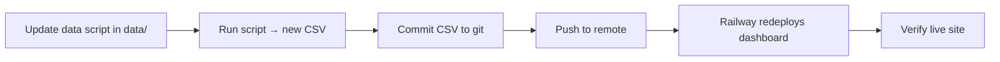

# Interactive Dashboards

This folder contains the **interactive dashboards** published on the [Regulatory Studies Center website](https://regulatorystudies.columbian.gwu.edu/interactive-dashboards-1). Each dashboard is a small web app that lets visitors explore RegStats data—filter by administration, agency, or time period, and download charts or data.

---

## How dashboards relate to the rest of RegStats

RegStats is organized around two main workflows:

| Part of the repo | What it does 
|------------------|--------------
| [`data/`](../data/) | Collects and stores the underlying numbers (CSV files) | 
| [`charts/`](../charts/) | Turns those numbers into static PDF/PNG charts for the main RegStats page |
| **`dashboards/`** (this folder) | Turns the same CSV files into **interactive** web dashboards |

**Important:** Dashboards do not scrape or calculate data on their own. They **read CSV files** that already live in `data/`. To refresh a dashboard, you almost always:

1. **Update the data** in `data/` (see that folder’s README).
2. **Redeploy** the dashboard (or restart it locally) so it picks up the new CSV.

The root [README](../README.md) has a full list of every RegStats dataset, its update schedule, and the scripts that produce each CSV.

---

## Repository layout

```
dashboards/
├── README.md                          ← you are here
├── monthly_sig_rules_by_admin/        ← monthly significant rules by administration
├── cumulative_econ_sig_rules_by_admin/← cumulative economically significant rules
├── econ_sig_rules_by_agency/          ← economically significant rules by agency
├── fr_rules_by_agency/                ← Federal Register rules by agency
├── cfr_by_title/                      ← CFR page & word counts by title
├── reg_budget_outlays/                ← regulators' budget outlays
└── reg_budget_personnel/              ← regulators' budget personnel
```

Each live dashboard folder typically contains:

| File | Purpose |
|------|---------|
| `*.py` | The Streamlit app (the actual dashboard) |
| `requirements.txt` | Python packages needed to run the app |
| `railway.toml` | Deployment settings for [Railway](https://railway.app/) (when present) |
| `Procfile` | Alternative start command for hosting platforms |
| `README.md` | Dashboard-specific notes (when present) |

Some dashboards (e.g. `monthly_sig_rules_by_admin`) nest the app under a `files/` subfolder for deployment reasons. The `railway.toml` in that folder points to the correct path—use that file as the source of truth for how to start the app.

Shared branding assets (GW logo, Avenir font) live in [`charts/style/`](../charts/style/) and are loaded automatically when the app runs from the **repository root**.

---

## How to redeploy a Dashbaord

1. **Check the update schedule** — Use the table above or the root README to see when each dataset should be refreshed.
2. **Update the CSV** — Follow the README in the relevant `data/` folder. Many datasets have an automated Python script; some can be updated manually in Excel or Google Sheets (then save as CSV).
3. **Ask for a redeploy** — After the CSV is updated and committed to the repository, someone with Railway access needs to redeploy the matching dashboard service (or trigger a deploy from a git push, if that is already configured).
4. **Verify on the live site** — Open the [interactive dashboards page](https://regulatorystudies.columbian.gwu.edu/interactive-dashboards-1), find your dashboard, and confirm the latest month/year appears and download buttons work.

### Prerequisites

- Python 3.10+ (see each folder’s `runtime.txt` if present)
- Git access to this repository
- Optional: [Railway](https://railway.app/) access for production deploys

### Run a dashboard locally

From the **repository root** (not inside the dashboard folder):

```bash
# Example: monthly significant rules dashboard
pip install -r dashboards/monthly_sig_rules_by_admin/files/requirements.txt
streamlit run dashboards/monthly_sig_rules_by_admin/files/monthly_sig_rules.py
```

Replace the paths with the dashboard you are working on. Streamlit will print a local URL (usually `http://localhost:8501`).

**Tip:** Running from the repo root matters. Most apps resolve data with `parents[2]` or similar paths so they can find `data/`.

### Routine update workflow



1. Run the appropriate update script in `data/` (documented in that folder’s README).
2. Confirm the CSV changed as expected (open in a spreadsheet or diff in git).
3. Commit and push.
4. Redeploy on Railway if auto-deploy is not enabled.
5. Smoke-test the live dashboard.

### Deploying on Railway

**Recommended setup for all dashboards:** set the Railway service **Root Directory** to the **repository root** (leave blank), not the individual dashboard folder. Each `railway.toml` file includes a `startCommand` that runs Streamlit with the full path from the repo root.

Example from `cfr_by_title/railway.toml`:

```
streamlit run dashboards/cfr_by_title/cfr_by_title.py --server.port=$PORT --server.address=0.0.0.0 --server.headless=true
```

In Railway:

1. Create or open the service for the dashboard.
2. Set **Config file path** to `dashboards/<folder>/railway.toml` if Railway does not pick it up automatically.
3. Ensure the build installs from that folder’s `requirements.txt`.
4. Push to the connected branch to trigger a deploy.

`cumulative_econ_sig_rules_by_admin` has extra deployment notes in its own README (environment variables `DATA_ROOT`, `CUMULATIVE_ES_RULES_CSV`, `STYLE_DIR`) if you must deploy with a subfolder as root—see [`cumulative_econ_sig_rules_by_admin/README.md`](cumulative_econ_sig_rules_by_admin/README.md).

### Adding a new dashboard

1. Create a new folder under `dashboards/` with a descriptive name (match existing naming: `snake_case`, topic-focused).
2. Add a Streamlit `.py` file that reads from an existing `data/` CSV.
3. Add `requirements.txt` (copy from a similar dashboard and adjust).
4. Add `railway.toml` with repo-root deploy settings (copy from `cfr_by_title` or `econ_sig_rules_by_agency`).
5. Document the dashboard in this README (catalog table) and add a short README in the folder if deployment is non-obvious.
6. Link the new app from the GW website interactive dashboards page (outside this repo).

Reuse [`charts/style/`](../charts/style/) for GW colors, logo, and font so dashboards match RegStats branding.

---

## Quick reference: data README locations

| Dashboard | Data update instructions |
|-----------|--------------------------|
| Monthly significant rules | [`data/monthly_es_rules/README.md`](../data/monthly_es_rules/README.md) |
| Cumulative ES rules | [`data/cumulative_es_rules/`](../data/cumulative_es_rules/) (see scripts in folder) |
| ES rules by agency | [`data/es_rules/`](../data/es_rules/) |
| FR rules by agency | [`data/fr_rules/`](../data/fr_rules/) |
| CFR by title | [`data/cfr_pages/by_title/`](../data/cfr_pages/by_title/) |
| Reg budget (planned) | [`data/reg_budget/README.md`](../data/reg_budget/README.md) |

---

**Monthly updates:** update `monthly_es_rules` and `cumulative_es_rules` data in the first week of each month, then verify both related dashboards on the live site.

**Annual rhythm (February):** several `data/` folders update in the first week of February—coordinate with the static RegStats chart updates.

---


