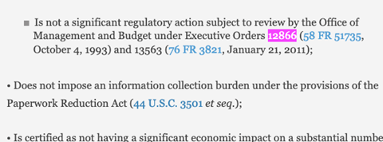
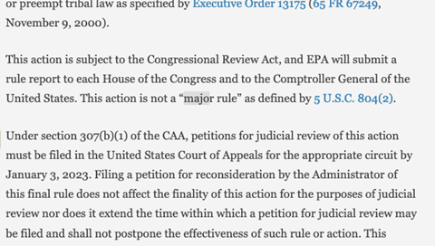

# Daily Federal Register Tracking

## Last Updated

README: 2024-06-12

Data: ~weekly

## Update Instructions

1. Check the date through which the data in `fr_tracking.csv` have been updated. Retrieve the rules published between the last issue included in the tracking document and the current issue of the Federal Register. There are two ways to do this:
    - Use the [web app](https://regulatorystudies.shinyapps.io/fr-tracking/) to retrieve the rules (excluding corrections) and download them as a csv file.
    - Use the command line Python program to retrieve the rules (excluding corrections) and download them as a csv file. You will need Python 3.10 or greater installed on your computer. See commands below (creating the virtual environment and installing dependencies is only necessary the first time).
      - Navigate to the local folder where the program is located: `cd USER/PATH/TO/Reg-Stats/data/fr_tracking`
      - Create a virtual environment: `python -m venv myenv`
        - you can name the virtual environment anything you'd like (here it's "myenv")
    - Activate the virtual environment:
       - macOS/linux: `source myenv/bin/activate`
       - Windows: `myenv/scripts/activate`
    - Install the dependencies into myenv: `python -m pip install -r requirements.txt`
    - Run the code: `python ./rule_tracking/retrieve_rules.py`

1. Add the retrieved rules as new rows to the spreadsheet.
1. Work through the new rules one by one. Pull up the rule on [federalregister.gov](https://www.federalregister.gov) using the url in the spreadsheet. Supplement missing values in the columns with metadata from the Federal Register website.
    - Many values can be found in the grey box at the top right. Typically, you can find “RIN” and “Agency/Docket Number” there.
    - RIN is sometimes missing from this box, and Agency/Docket Number often is. It’s often worth a quick scan of the document to look for RIN elsewhere, or worth checking reginfo.gov, but sometimes one just doesn’t exist. Don’t worry if Agency/Docket information is missing.
1. To determine if a rule is significant/economically significant, search by “Control-F”ing the word “significant” on the webpage, as well as “12866”. This should bring you to the part of the document which discusses whether it is a significant rule. Enter a “1” if it is significant (and a 1 in the economically significant column as well if it is economically significant). If it is not, enter a “0”. If it does not say, enter a “.”.  
\
See **Other Tips** below for tips on ambiguous cases.
1. To determine if a rule is “major” search by “Control-F”ing the word “major” on the webpage, as well as “Congressional”. This should bring you to the part of the document which discusses whether it is a major rule. Enter a “1” if it is major. If it is not, enter a “0”. If it does not say, enter a “.”.  

   - Alternatively, an agency may identify a rule as major by referring to the relevant section of the U.S. Code. You may come across a sentence alongs the lines of: "This action meets the criteria set forth in 5 U.S.C. 804(2)." Also mark such rules as major=1.

### Other Tips:  
- For missing values, add a “.” in the cell so reviewers know you did not just forget. 
- There is often confusion about whether a significant rule is also section 3(f)(1) significant (only applicable to rules published after April 6, 2023 and before January 21, 2025). The following tips may help:
  - Rules that mention EO 14094 are not necessarily section 3(f)(1) significant. It is important to note whether it says that it is significant under **Section 3(f)(1)** of EO 14094.
  - Some section 3(f)(1) significant rules do not mention the section number but mention the monetary threshold of $200 million.
  - Rules that are not major are less likely to be section 3(f)(1) significant.
  - Rules that do not explictly mention whether they are section 3(f)(1) significant in any ways are more likely to be **not** section 3(f)(1) significant, but look through other sections (e.g., benefits and costs) for cost/benefit estimates to confirm.
- Use reginfo.gov as a secondary source for double-checking the significance designation.  
  - To find the rule on reginfo.gov, click Document Details on the Federal Register page of the rule. If there is a RIN, which is often hyperlinked, click on it, and you will be directed to a reginfo.gov page with a list of Unified Agendas in which the rule appeared. Click on the latest Unified Agenda on the page, and look for the Priority field, which includes the significance designation from the Unified Agenda.
  - Note that the designation from the Unified Agenda is not always accurate and may be different from the Federal Register preamble. Because the Unified Agenda is forward-looking, agencies or OIRA may change the designation when the rule is actually published. Therefore, always use the Federal Register preamble as the primary source for this information, and use reginfo.gov as a supplementary source only (if at all).
 

## Environment Set Up

If your computer's environment is set up with [Python 3.11](https://www.python.org/downloads/) and the necessary packages, you should be able to run the code.

First, install a Python interpreter to run the code. Some suggested download options are from [Anaconda](https://www.anaconda.com/download) or [Python.org](https://www.python.org/downloads/).

Second, download the code by [cloning](https://docs.github.com/en/repositories/creating-and-managing-repositories/cloning-a-repository) this Github repository.

Third, create a separate virtual environment for running the program. This is easy to do with the `venv` module in the [Python standard library](https://docs.python.org/3/library/venv.html) and the `requirements.txt` file in this repository. Enter the following commands in the terminal / command line:

```{sh}
cd "PATH/TO/YOUR/LOCAL/PROJECT/DIRECTORY/"

python -m venv myenv  # where myenv is your virtual environment's name

myvenv/scripts/activate  # activate on Windows
source myvenv/bin/activate  # activate on macOS/linux

python -m pip install -r requirements.txt
```

If you have issues installing the packages from the requirements.txt, it may be because OS-specific packages are included in the requirements.txt. To get around this, different requirements.txt files may exist in this repo (e.g., requirements-win.txt, requirements-mac.txt) that can be substituted in the commands used. Alternatively, generating a new requirements.txt using the [pip-tools](https://pip-tools.readthedocs.io/en/stable/) package would be a good approach. After activating your virtual environment, run the following commands in the terminal:

```{sh}
python -m pip install -U pip pip-tools

pip-compile -o my_requirements.txt requirements.in

pip-sync my_requirements.txt
```

## Updating the Web App

When updates are made to the application code, you will need to deploy a revised version of the web app. The app was developed with the Shiny for Python package and is currently deployed using shinyapps.io. To re-deploy the app, please take the following steps:

- Set up your environment and install the required packages.
- Configure your rsconnect-python installation, so you can use it to upload applications to shinyapps.io.
  - Log in to the regulatorystudies shinyapp.io account, go to Account -> Tokens, and generate a new token (or use an existing token)
  - Follow the instructions in the [shinyapps.io documentation](https://docs.posit.co/shinyapps.io/guide/getting_started/#working-with-shiny-for-python).
- Run the `deploy.bat` script, which contains the commands needed to push an updated version of the application.
  - On Windows, this can be done by navigating to the root directory (`~/fr_tracking/`) and running `& deploy.bat` from the command line.
  - You can also copy the commands from the script and run them in the terminal directly.
